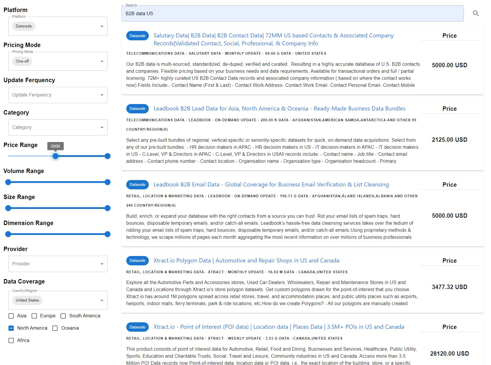

# DaDaDa:  Dataset for Data Products in Data Marketplaces
## Introduction

Data-driven machine learning models have profoundly impacted various industries, highlighting the importance of accessible, diverse, and well-structured data. Rec- ognizing the value of data, an increasing trend of data transactions has emerged, giving rise to many data marketplaces such as AWS Marketplace, Databricks, and Datarade. However, determining the appropriate prices for data products remains a significant challenge. Common pricing methods can be categorized into the cost approach, the income approach, and the sales comparison approach. While the first two are not applicable due to the unique properties of data products, the third approach is limited by the lack of systematic and comparable pricing information for data products in data marketplaces. To address this challenge, we introduce **DaDaDa**, the first dataset for data product pricing, containing metadata for **16,147** data products from 9 major data marketplaces worldwide. By training a pricing model on the curated metadata, we provide valuable references for pricing new data products. Furthermore, DaDaDa can be utilized for other important tasks in data markets, such as data product classification and retrieval. 

## Environment

Project dependencies can be installed in the following ways:

```
pip install -r requirements.txt
```

We use a server with an NVIDIA A100 GPU(80GB) and 160 Intel(R) Xeon(R) Platinum 8383C CPU @ 2.70GHz for all empirical experiments in this manuscript. The operating system is Ubuntu 20.04.6.

## Repository structure

The directory is organized as

```shell
.
├── croissant_metadata.json
├── DaDaDa/
│   ├── data/
│   │   ├── final_data.csv
│   │   ├── merge_data.py
│   │   ├── preprocess_data/
│   │   ├── preprocess_raw.py
│   │   ├── raw_data/
│   │   └── samples/
│   └── experiment/
│       ├── classification/
│       └── pricing/
├── images/
├── LICENSE
└── README.md
```

| Leaf directory / file   | Content                                                      |
| ----------------------- | ------------------------------------------------------------ |
| croissant_metadata.json | Croissant metadata record                                    |
| final_data.csv          | The metadata for all **16,147** data products.               |
| merge_data.py           | Combine all the information of data products from the preprocessed `preprocess_data` directory together. |
| preprocess_data/        | Store the preprocessed data after integrating the raw data.  |
| preprocess_raw.py       | Process the data in  `raw_data` into a unified format and store it in the `preprocess_data` folder. |
| raw_data/               | Store raw data after data scraping and manual annotation.    |
| samples/                | Store the data sample of partial data products.              |
| classification/         | Experimental code related to the classification of data products. |
| pricing/                | Experimental code related to the pricing of data products.   |
| images/                 | Store the images used in this repository.                    |


### Composition of DaDaDa

DaDaDa contains metadata for 16,147 data products collected from 9 major data marketplaces. The
features comprising DaDaDa are detailed below.

- **title.** The title or short description of the data product.
- **url.** The web address of the detail page of the data product.
- **platform.** The name of the data marketplace hosting the data product.
- **provider.** The name of the data provider as made available by the data marketplace. There are
  a total of 1,992 data providers, with “Techsalerator” being the leading provider, offering 644 data
  products.
- **description.** The detailed description of the data product.
- **volume.** The number of records.
- **size.** The data size (in Byte) provided by the data product.
- **dimension.** The number of data features.
- **coverage.** The countries covered by the data product.
- **update_frequency.** The frequency between data product updates as announced by the seller, such
  as “monthly”, “daily”, and “real-time”. Most data products adopt “no-update” and “daily”.
- **data_sample.** The filename of the data sample if available. We download and store the data
  sample of data products in an additional folder.
- **category.** The original category of data product may vary across different data marketplaces,
  each with its own way of categorization. We align the data categories from other marketplaces with
  the AWS Marketplace categories through manual labeling. 
- **price_mode.** The pricing mode of the data product. There are five pricing modes: (1) negotiation
  mode where data buyers need to negotiate the price with data providers, (2) free mode where the
  data is provided at no cost, (3) subscription mode where data buyers are charged a recurring fee on a monthly or annual basis, (4) one-off mode where data buyers pay a one-time fee to access the data permanently, and (5) usage-based mode where data buyers are charged based on the amount of data they consume, such as the volume of data downloaded or the number of API calls. 
- **price.** Using USD ($) as the currency unit. If the pricing mode is free or negotiation, the price is
  set to 0. If the pricing mode is subscription, the price represents the subscription cost for 12 months; If the pricing mode is usage-based, the price reflects the cost for a single usage.

Table 1 shows the quantity and proportion of data products in each category within DaDaDa.

#### Table1

| Data Product Category               | Quantity | Percentage(%) |
| ----------------------------------- | -------- | ------------- |
| Retail, Location and Marketing Data | 5702     | 35.3          |
| Financial Services Data             | 3682     | 22.8          |
| Telecommunications Data             | 1180     | 7.3           |
| Media and Entertainment Data        | 1143     | 7.1           |
| Healthcare and Life Sciences Data   | 1085     | 6.7           |
| Public Sector Data                  | 1054     | 6.5           |
| Manufacturing Data                  | 807      | 5.0           |
| Resources Data                      | 551      | 3.4           |
| Environmental Data                  | 440      | 2.7           |
| Automotive Data                     | 387      | 2.4           |
| Other                               | 107      | 0.7           |
| Gaming Data                         | 9        | 0.1           |

Table2  presents the quantity and proportion of usage for different price_modes within DaDaDa.

#### Table2

| Data Product price_mode | Quantity | Percentage(%) |
| ----------------------- | -------- | ------------- |
| free                    | 6706     | 41.5          |
| negotiation             | 4510     | 27.9          |
| subscription            | 2854     | 17.7          |
| one-off                 | 1450     | 9.0           |
| usage-based             | 627      | 3.9           |

## Experiment

### data product classification

DaDaDa supports training classification models to assist in classifying new data products into prede-
fined categories based on their metadata. To validate its effectiveness, we fine-tune two multilingual
pretrained models: mBERT (bert-base-multilingual-cased) and XLM-RoBERTa-Large,
testing their classification performance.

#### How to use

The  download address of two pre-trained models  is [mbert](https://huggingface.co/google-bert/bert-base-multilingual-cased)  and [XLM-RoBERTa-Large](https://huggingface.co/FacebookAI/xlm-roberta-large) . We also try the [XLM-RoBERTa-base](https://huggingface.co/FacebookAI/xlm-roberta-base) ,  however, its performance is not as good as the larger model XLM-RoBERTa-Large of the same type, so we did not present its results in the paper.

You can download the model from the [Hugging Face](https://huggingface.co/) website to your local machine and replace the model path in `fine_tune.py` with the local path, or simply use the default path to download it directly.  

You can  use in the following ways:

```shell
# fine-tune and test the classification model
python fine_tune.py --model 'model_name'  --mode 'train'

# just test the best fine-tuned model
python fine_tune.py --model 'model_name' --mode 'test'
```

The model_name should be one of the three: "mbert", "xlm-r-base", "xlm-r-large".  We store our best fine-tuned model in [best_model](./DaDaDa/experiment/classification/best_model).

### data product reterival

DaDaDa makes it possible to create a vertical search
engine for data products collected from major open-access data marketplaces around the world. To
demonstrate how DaDaDa can streamline the data search process, we use it to create a search engine
based on Elasticsearch.

The following image is a screenshot of the data product search engine.



### data product pricing

DaDaDa collects important metadata and pricing information for data products, which can greatly
assist in making pricing decisions. To validate the effectiveness of DaDaDa, we use it to train models
and evaluate pricing performance.

#### How to use

We first use [get_embedding.py](./DaDaDa/experiment/pricing/embedding) to extract embeddings from the fine-tuned XLM-R-Large model, capturing both the intermediate and final layer word embeddings, resulting in two files [xlm-r-large_12_embeddings.csv](./DaDaDa/experiment/pricing/embedding) and [xlm-r-large_24_embeddings.csv](./DaDaDa/experiment/pricing/embedding). Then we use [pca.py](./DaDaDa/experiment/pricing/embedding) to determine the appropriate dimensionality reduction. Finally, we process the data in [final_data.csv](./DaDaDa/data) using [preprocess.py](./DaDaDa/experiment/pricing) and merge it with the dimensionally reduced embeddings, getting two price files  [price_12.csv](./DaDaDa/experiment/pricing) and [price_24.csv](./DaDaDa/experiment/pricing).

The code of training pricing model is store in [price](./DaDaDa/experiment/pricing/price_model),  we use [find_best_hp.py](./DaDaDa/experiment/pricing/price_model) to find the best hyperparameter for different regression models, and store the best model in [saved_models_12](./DaDaDa/experiment/pricing/price_model) (for intermediate layer) and  [saved_models_24](./DaDaDa/experiment/pricing/price_model) (for last layer). 

You can use in the following ways:

```shell
# train the price model
python price_model.py --file 'file_name' --mode 'train'

# test the price model
python price_model.py --file 'file_name' --mode 'test'

# train the dnn price model
python price_dnn.py --file 'file_name' --mode 'train'

# test the dnn price model
python price_dnn.py --file 'file_name' --mode 'test'
```


